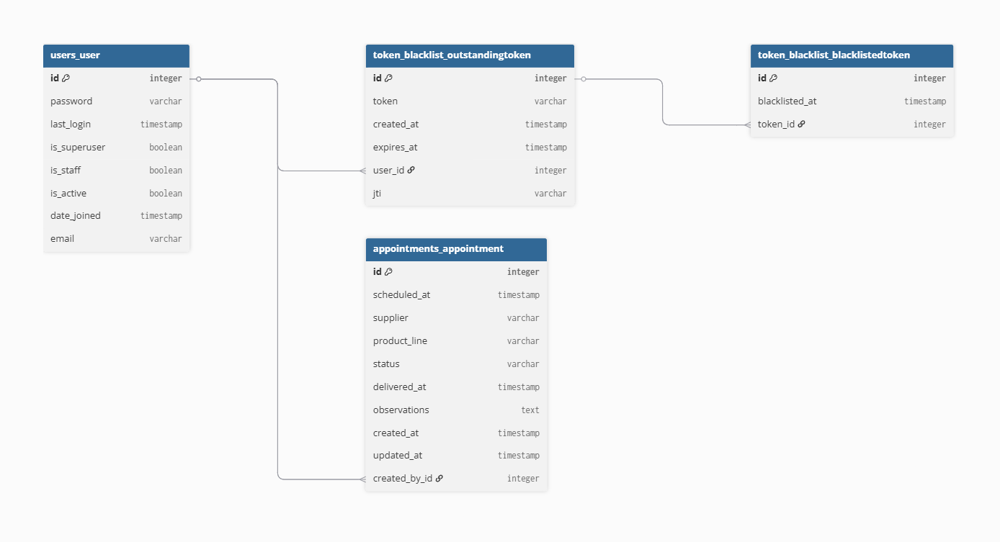

# Big-Jhon-Test - Sistema de Gestión de Citas de Entrega - (React + Django + PostgreSQL)

## 1. Descripción General

Desarrollo de una aplicación web fullstack para la gestión de citas de entrega de mercancía en una empresa de retail textil. La solución permite el registro, seguimiento y reporte de indicadores clave, aplicando una arquitectura desacoplada y robusta.

## 2. Arquitectura del Proyecto

El sistema sigue principios de **Clean Architecture** y **Diseño Orientado a Dominios (DDD)**, asegurando que la lógica de negocio sea independiente de los detalles de implementación.

### Diagrama de Arquitectura

```text
      +-------------------------------------------------------------+
      |                       USUARIO / BROWSER                     |
      +------------------------------+------------------------------+
                                     |
                                     v
      +-------------------------------------------------------------+
      |                 FRONTEND (React + Vite + Bun)               |
      |  +------------+      +------------+      +---------------+  |
      |  | Components | <--> |   Hooks    | <--> | API (Axios/RQ)|  |
      |  +------------+      +------------+      +---------------+  |
      +------------------------------+------------------------------+
                                     | (REST API / JWT)
                                     v
      +-------------------------------------------------------------+
      |               BACKEND (Django REST Framework)               |
      |  +-------------------------------------------------------+  |
      |  | Presentation (Views, Serializers, Endpoints)          |  |
      |  +---------------------------+---------------------------+  |
      |                              |                              |
      |  +---------------------------v---------------------------+  |
      |  | Application (Use Cases, Services)                     |  |
      |  +---------------------------+---------------------------+  |
      |                              |                              |
      |  +---------------------------v---------------------------+  |
      |  | Domain (Entities, Business Logic)                     |  |
      |  +---------------------------+---------------------------+  |
      |                              |                              |
      |  +---------------------------v---------------------------+  |
      |  | Infrastructure (PostgreSQL, ORM, Raw SQL)             |  |
      |  +-------------------------------------------------------+  |
      +-------------------------------------------------------------+
```

### Estructura de carpetas y archivos

```text
BIG-JHON-TEST/
├── backend/
│   ├── appointments/           # Módulo de Citas (DDD)
│   │   ├── application/        # Casos de uso
│   │   ├── domain/             # Entidades y lógica de negocio
│   │   ├── infrastructure/     # Repositorios y persistencia
│   │   ├── management/         # Comandos de gestión (Seeders)
│   │   ├── migrations/         # Migraciones de BD
│   │   ├── presentation/       # API Views y Serializers
│   │   ├── tests/              # Pruebas unitarias
│   │   ├── admin.py
│   │   ├── apps.py
│   │   ├── docs.yaml           # Documentación OpenAPI específica
│   │   └── models.py
│   ├── config/                 # Configuración del core de Django
│   ├── users/                  # Módulo de Autenticación y Usuarios
│   │   ├── application/
│   │   ├── domain/
│   │   ├── infrastructure/
│   │   ├── management/
│   │   ├── migrations/
│   │   ├── presentation/
│   │   ├── admin.py
│   │   ├── apps.py
│   │   ├── docs.yaml
│   │   └── models.py
│   ├── dockerfile
│   ├── manage.py
│   ├── pyproject.toml          # Configuración de dependencias (uv)
│   ├── requirements.txt
│   └── uv.lock
├── frontend/
│   ├── public/                 # Activos estáticos
│   ├── src/
│   │   ├── api/                # Cliente Axios y React Query
│   │   │   ├── reactQuery/
│   │   │   ├── axiosConfig.ts
│   │   │   └── endpoints.ts
│   │   ├── components/         # Componentes UI reutilizables
│   │   ├── constants/          # Enums y rutas constantes
│   │   ├── containers/         # Layouts y Páginas (Vistas)
│   │   │   ├── layout/
│   │   │   └── pages/
│   │   ├── hooks/              # Hooks personalizados (useAuth)
│   │   ├── interfaces/         # Definiciones de TypeScript
│   │   ├── router/             # Configuración de rutas y Guards
│   │   │   ├── PrivateRoute.tsx
│   │   │   └── routes.tsx
│   │   ├── main.scss           # Estilos globales
│   │   └── main.tsx            # Punto de entrada
│   ├── bun.lock                # Lockfile de Bun
│   ├── dockerfile
│   ├── eslint.config.js        # Linter de Frontend
│   ├── index.html
│   ├── package.json
│   ├── tsconfig.json           # Configuración de TypeScript
│   └── vite.config.ts
├── docker-compose.yml          # Orquestación de servicios
└── README.md
```

## 3. Diagrama Entidad-Relación (MER)
El diagrama se encuentra disponible en la raíz del proyecto como `Diagrama-MER.png`. Cabe resaltar que dicho MER solo tiene en cuenta las tablas usadas en el proyecto. Al crear la base de datos, aparecen otras tablas que Django crea por defecto pero no son usadas en esta solución. A continuación se comparte un link para revisar dicho MER más a detalle. [Documentación MER en dbdocs](https://dbdocs.io/mcartage33/big-jhon-test)




## 4. Consideraciones Generales
- El frontend corre por defecto en el puerto **5173** y el backend en el puerto **8000**.

**Requisitos previos:**
- Docker y Docker Compose (recomendado para ejecución rápida).
- Python 3.12+ y `uv` (para ejecución local del backend).
- Node.js 20+ y Bun (para ejecución local del frontend).

### 4.1 Dependencias Utilizadas

### Backend
- **Django 6.0.3**: Framework principal de desarrollo web.
- **Django REST Framework 3.17.0**: Toolkit para crear APIs REST.
- **djangorestframework-simplejwt 5.5.1**: Autenticación basada en JWT para APIs.
- **drf-spectacular 0.29.0**: Generación automática de documentación OpenAPI/Swagger.
- **PostgreSQL**: Base de datos relacional utilizada por el proyecto.
- **django-cors-headers 4.9.0**: Manejo de CORS para permitir solicitudes desde el frontend.
- **APITestCase**: Para pruebas unitarias de las APIs con Django REST Framework.

### Frontend
- **React 18 & Vite**: Librería de UI y herramienta de construcción rápida.
- **Bun**: Tiempo de ejecución y gestor de paquetes.
- **React Query (TanStack)**: Gestión de estado asíncrono y caché de API.
- **Axios**: Cliente HTTP para comunicación con el backend.
- **Ant Design**: Framework de estilos para diseño responsive.
- **Otras librerías importantes**:
  - **@ant-design/icons 6.1.0**: Íconos para Ant Design.
  - **chart.js 4.5.1** y **react-chartjs-2 5.3.1**: Gráficos y visualización de datos.
  - **date-fns 4.1.0** y **dayjs 1.11.20**: Manipulación y formateo de fechas.
  - **react-icons 5.6.0**: Colección de íconos para React.
  - **react-router-dom 7.13.2**: Enrutamiento en React.

## 5. Instalación y Ejecución

### Opción 1: Con Docker (Recomendado)
Desde la raíz del proyecto, ejecuta el siguiente comando para levantar la base de datos, el backend y el frontend automáticamente:

```bash
docker compose up --build
```

### Opción 2: Ejecución Local
#### Backend **(Asegurate previamente que PostgresSQL este corriendo localmente en el puerto 5432)**
1. Navega al directorio del backend:
```bash
cd /backend
```
2. Instala dependencias
```bash
uv sync
```
ó
```bash
uv pip install -r requirements.txt
```
3. Crea las migraciones y correlas
```bash
uv run python manage.py makemigrations
```
```bash
uv run python manage.py migrate
```
4. Ejecuta las semillas
```bash
uv run python manage.py seed_users
```
```bash
uv run python manage.py seed_appointments
```
